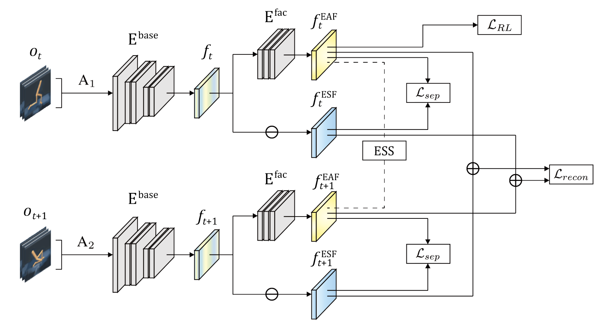

# Environment Agnostic Representation for Visual Reinforcement learning (ICCV23)

This is an official Pytorch implementation of the paper [Environment Agnostic Representation for Visual Reinforcement learning].(https://openaccess.thecvf.com/content/ICCV2023/papers/Choi_Environment_Agnostic_Representation_for_Visual_Reinforcement_Learning_ICCV_2023_paper.pdf):

```
@inproceedings{choi2023environment,
  title={Environment Agnostic Representation for Visual Reinforcement Learning},
  author={Choi, Hyesong and Lee, Hunsang and Jeong, Seongwon and Min, Dongbo},
  booktitle={Proceedings of the IEEE/CVF International Conference on Computer Vision},
  pages={263--273},
  year={2023}
}
```

Our implementation is based on [SAC](https://github.com/denisyarats/pytorch_sac_ae), [PAD](https://github.com/nicklashansen/policy-adaptation-during-deployment), and [DM Control Suite](https://github.com/google-deepmind/dm_control).
